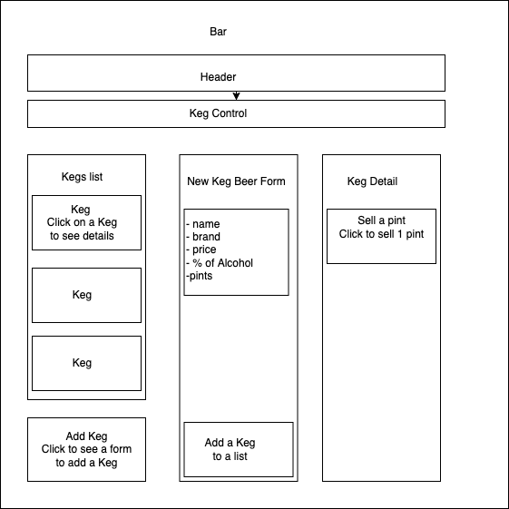

# 
_Tap room_

## About the Project
### Description

_`Tap room` is the app where a bar stuff can track their kegs. This application is built utilizing JavaScript and React.
The application has following functionality:_

* A user may see a list of all available keg beers. For each keg, they can see its `name`, `brand`, `price` and `alcoholContent`.
* A user can submit a form to `add` a new keg beer to a list.
* A user is able to click on a keg to see its `detail` page.
* A user may see how many pints are left in a keg. A full keg has roughly `124` pints.
* A user should be able to click a button `Sell a pint` in beer details when they sell a pint of it. This should decrease the number of pints left by 1.
* Pints is not be able to go below `0`. Once keg is empty, user have a message `Out of Stock` 

### Technologies Used

* _JavaScript_
* _React_
* _jQuery_
* _VisualStudio Code_
* _Git_
* _GitHub_

### Component Diagram

<!-- /Users/evgeniya/Projects/tap-room/src/img/bar-diagram.png -->
### Known Bugs

_After selling a pint, kegBeerList doesn't update properly_

## Setup and Use
### Cloning the project
1. _Navigate to my  https://github.com/evmeshuris/tap-room.git_ to view the project files and commits.
2. _Click on the green button labeled `Code`_ to copy repository URL.
3. _Clone the repository to your local machine_ by opening your machine terminal and using the command `git clone https://github.com/evmeshuris/tap-room.git`.

### Running Application 

1. _Navigate to the project folder in the command line._
2. _Run the following command: $ `npm install`_
3. _Run the following command: $ `npm start`_

## License 

*This software is licensed under the [MIT](https://choosealicense.com/licenses/mit/) license*

Copyright (c) 2022 **_Evgeniya Meshuris_**

## Additional Info
## Getting Started with Create React App

This project was bootstrapped with [Create React App](https://github.com/facebook/create-react-app).

### Available Scripts

In the project directory, you can run:

#### `npm start`

Runs the app in the development mode.\
Open [http://localhost:3000](http://localhost:3000) to view it in the browser.

The page will reload if you make edits.\
You will also see any lint errors in the console.

#### `npm test`

Launches the test runner in the interactive watch mode.\
See the section about [running tests](https://facebook.github.io/create-react-app/docs/running-tests) for more information.

#### `npm run build`

Builds the app for production to the `build` folder.\
It correctly bundles React in production mode and optimizes the build for the best performance.

The build is minified and the filenames include the hashes.\
Your app is ready to be deployed!

See the section about [deployment](https://facebook.github.io/create-react-app/docs/deployment) for more information.

#### `npm run eject`

**Note: this is a one-way operation. Once you `eject`, you can’t go back!**

If you aren’t satisfied with the build tool and configuration choices, you can `eject` at any time. This command will remove the single build dependency from your project.

Instead, it will copy all the configuration files and the transitive dependencies (webpack, Babel, ESLint, etc) right into your project so you have full control over them. All of the commands except `eject` will still work, but they will point to the copied scripts so you can tweak them. At this point you’re on your own.

You don’t have to ever use `eject`. The curated feature set is suitable for small and middle deployments, and you shouldn’t feel obligated to use this feature. However we understand that this tool wouldn’t be useful if you couldn’t customize it when you are ready for it.

### Learn More

You can learn more in the [Create React App documentation](https://facebook.github.io/create-react-app/docs/getting-started).

To learn React, check out the [React documentation](https://reactjs.org/).

#### Code Splitting

This section has moved here: [https://facebook.github.io/create-react-app/docs/code-splitting](https://facebook.github.io/create-react-app/docs/code-splitting)

#### Analyzing the Bundle Size

This section has moved here: [https://facebook.github.io/create-react-app/docs/analyzing-the-bundle-size](https://facebook.github.io/create-react-app/docs/analyzing-the-bundle-size)

#### Making a Progressive Web App

This section has moved here: [https://facebook.github.io/create-react-app/docs/making-a-progressive-web-app](https://facebook.github.io/create-react-app/docs/making-a-progressive-web-app)

#### Advanced Configuration

This section has moved here: [https://facebook.github.io/create-react-app/docs/advanced-configuration](https://facebook.github.io/create-react-app/docs/advanced-configuration)

#### Deployment

This section has moved here: [https://facebook.github.io/create-react-app/docs/deployment](https://facebook.github.io/create-react-app/docs/deployment)

#### `npm run build` fails to minify

This section has moved here: [https://facebook.github.io/create-react-app/docs/troubleshooting#npm-run-build-fails-to-minify](https://facebook.github.io/create-react-app/docs/troubleshooting#npm-run-build-fails-to-minify)
